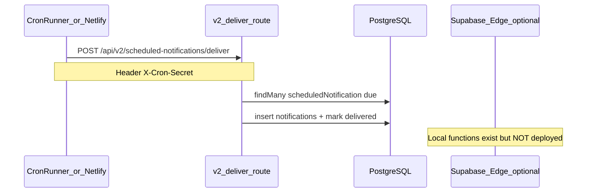

# Foundational Audit — MealTime MASTER REPORT

> **Marco foundational de dívida técnica** — relatório único consolidado (extensão da auditoria de 2 jul 2026, pós R1–R2).

**Data:** 2 de julho de 2026  
**Escopo:** `D:/Mauricio/Code/mealtime` + verificação ao vivo (Supabase, Netlify, `mealtime.app.br`)  
**Baseline reproduzível:** [`docs/reports/baseline-2026-07-02/`](./baseline-2026-07-02/)  
**Anexos históricos:** `FOUNDATIONAL-AUDIT-2026-*.md` (substituídos por este documento como fonte de verdade)

---

## 1. Executive Summary

### Scores de saúde

| Escopo | Score | Δ vs auditoria inicial |
|--------|-------|------------------------|
| **Codebase local** (pós R1–R2) | **57 / 100** | +3 |
| **Produção ao vivo** (`mealtime.app.br`) | **48 / 100** | −6 (deploy pendente) |

| Dimensão | Peso | Codebase | Produção | Notas |
|----------|------|----------|----------|-------|
| Segurança & Auth | 30% | 55 | 40 | R1 local OK; prod ainda 401 em v1; rotas v1 ativas |
| Qualidade de Build | 15% | 90 | 90 | lint + typecheck + build verdes |
| Arquitetura Frontend | 20% | 52 | 52 | 26 arquivos ainda em API v1; contexts facade |
| Testes & CI | 20% | 38 | 35 | CI básico; E2E com skips; sem unit tests |
| API & Dados | 10% | 68 | 65 | v2 sólida; 70% v1 ainda ativa |
| Documentação | 5% | 42 | 42 | ~177 docs; README stale |

### Top 15 issues (priorizadas)

| # | Sev | Issue | Evidência | Fase |
|---|-----|-------|-----------|------|
| 1 | **CRITICAL** | **R1 não deployado em produção** — v1 retorna 401, não 410 | curl `mealtime.app.br/api/feedings` | Deploy |
| 2 | **HIGH** | 28 rotas v1 ainda ativas (70% do v1) | Matriz API §4 | R3 |
| 3 | **HIGH** | `GET /api/feedings/cats` sem autenticação | `app/api/feedings/cats/route.ts` | R3 |
| 4 | **HIGH** | `GET/PATCH/DELETE /api/schedules/[id]` sem auth | `app/api/schedules/[id]/route.ts` | R3 |
| 5 | **HIGH** | Rate limit in-memory ineficaz em Netlify serverless | `lib/middleware/rate-limit.ts` | R3 |
| 6 | **HIGH** | 26 arquivos frontend ainda em `/api/` (não v2) | grep consumidores | R3 |
| 7 | **HIGH** | 15 arquivos ainda enviam `X-User-ID` (legado) | frontend grep | R3 |
| 8 | **HIGH** | ~37 `test.skip` — suíte E2E não confiável | 17 specs | R6 |
| 9 | **HIGH** | Sem `.env.test.local` / auth E2E falha em prod | `auth.setup.ts` timeout | R6 |
| 10 | **MEDIUM** | Prisma bypassa RLS Supabase (`DATABASE_URL`) | Arquitetura híbrida | R4 |
| 11 | **MEDIUM** | `cleanup_system_tables()` executável por `anon` | Supabase advisor | Infra |
| 12 | **MEDIUM** | Edge functions locais não deployadas (0 no cloud) | MCP `list_edge_functions` | R4 |
| 13 | **MEDIUM** | 373 react-doctor warnings; 118 unused files | baseline | R5 |
| 14 | **MEDIUM** | 10× `route.ts.bak` + docs contraditórios | `docs/todos/TASKS.md` | R5 |
| 15 | **LOW** | `proxy.ts` `apiRoutes` incompleto vs rotas reais | `proxy.ts:36-44` | R5 |

### Resolvidos desde auditoria inicial (R1–R2)

| Issue original | Status |
|----------------|--------|
| Spoofing `X-User-ID` em 11 rotas v1 | **RESOLVED** local (410); prod pendente |
| `POST deliver` v1 sem auth | **RESOLVED** local (410) |
| `GET /api/test-prisma` exposto | **RESOLVED** (404) |
| Build falha HapticsContext | **RESOLVED** |
| Zero CI | **RESOLVED** (`ci.yml`) |
| ESLint ignora tests/ | **RESOLVED** |
| mobile-safari ausente | **RESOLVED** |

---

## 2. Baseline Metrics

Comandos e outputs completos em [`baseline-2026-07-02/baseline-delta.md`](./baseline-2026-07-02/baseline-delta.md).

```bash
npm run lint          # Exit 0
npm run typecheck     # Exit 0
npm run build         # Exit 0 (~62s, Next.js 16.1, 95 static pages)
npx react-doctor .    # 373 warnings / 228 files
npx depcheck          # Ver depcheck.txt
```

| Métrica | Valor |
|---------|-------|
| Rotas API (`route.ts`) | 75 (40 v1 + 35 v2) |
| v2 com `withHybridAuth` | 33/35 (94%) |
| v2 com Zod | 21/35 (60%) |
| Contexts React | 17 arquivos (11 domínio + infra + legado) |
| Hooks domain RQ | 5 (`useCatsQuery`, `useHouseholdsQuery`, etc.) |
| Playwright specs | 19 |
| Docs markdown | ~177 |
| TODOs ativos no código | 14 arquivos |

---

## 3. Security & Auth Findings

### 3.1 Auth v2 (correto)

`withHybridAuth` (`lib/middleware/hybrid-auth.ts`):

1. `Authorization` header → JWT mobile (`validateMobileAuth`)
2. Senão → `supabase.auth.getUser()` + perfil Prisma
3. Falha → 401/404

v2 deliver: **somente** `X-Cron-Secret` === `CRON_SECRET` (cron-only, correto).

### 3.2 v1 — bloqueio parcial

**12 arquivos** retornam **410** via `v1DeprecatedResponse` (`lib/middleware/block-v1.ts`).

**28 arquivos v1 ainda ativos**, incluindo rotas sensíveis com Supabase `getUser` mas **sem** suporte JWT mobile (diverge do v2).

### 3.3 Vetores abertos

| Rota | Método | Auth | Risco |
|------|--------|------|-------|
| `/api/feedings/cats` | GET | **Nenhuma** (só `householdId`) | Enumeração de gatos |
| `/api/schedules/[id]` | GET/PATCH/DELETE | **Nenhuma** | CRUD por ID |
| `/api/swagger` | GET | Público | Info disclosure (baixo) |
| `/api/auth/mobile` | POST | Público (login) | Rate limit necessário |
| `/api/monitoring/errors` | POST | Auth opcional | Intencional |

### 3.4 Produção vs código

| Endpoint | Local | `mealtime.app.br` |
|----------|-------|-------------------|
| `GET /api/feedings` | 410 | **401** + session error |
| `POST .../deliver` v1 | 410 | **401** |
| `GET /api/test-prisma` | 404 | 404 |
| `GET /api/v2/cats` | 401 | 401 |

**Ação imediata:** deploy Netlify com branch atual antes de considerar R1 concluído em produção.

### 3.5 Supabase Auth advisors

- OTP expiry > 1h (WARN)
- Leaked password protection desabilitado (WARN)
- Postgres 15.8.1 patches disponíveis (WARN)

### 3.6 CORS e proxy

- `ALLOWED_ORIGINS` via env; fallback localhost em dev
- `proxy.ts` lista incompleta de `apiRoutes` (não inclui `/api/v2`, `/api/feedings`, etc.)
- Netlify env: `CRON_SECRET`, `DATABASE_URL`, Supabase keys presentes (keys only audit)

---

## 4. API v1→v2 Migration Status

### 4.1 Resumo

| Camada | Progresso | Detalhe |
|--------|-----------|---------|
| Backend v2 | **~85%** | 35 rotas; paridade funcional ampla |
| Backend v1 bloqueado | **30%** dos arquivos v1 | 12/40 |
| Frontend consumo v2 | **~35%** | 26 arquivos ainda v1 |
| Mobile API | Paralelo | `/api/mobile/cats` duplica v2 |

### 4.2 Mapa v1 bloqueado → v2

| v1 (410) | v2 |
|----------|-----|
| `/api/feedings` | `/api/v2/feedings` |
| `/api/feedings/[id]` | `/api/v2/feedings/[id]` |
| `/api/feedings/stats` | `/api/v2/feedings/stats` |
| `/api/goals` | `/api/v2/goals` |
| `/api/households/[id]/cats` | `/api/v2/households/[id]/cats` |
| `/api/households/[id]/invite*` | `/api/v2/households/[id]/invite*` |
| `/api/schedules` (list) | `/api/v2/schedules` |
| `/api/weight-logs`, `/api/weight/logs` | `/api/v2/weight-logs` |
| `/api/cats/[catId]/next-feeding` | `/api/v2/cats/[catId]/next-feeding` |
| `/api/scheduled-notifications/deliver` | `/api/v2/.../deliver` (cron) |

### 4.3 v1 ativo — prioridade de migração frontend

**Alta:** `FeedingsPageContent`, `WeightPageContent`, `NewSchedulePageContent`, `settings/page`, `HouseholdMembers`, `new-feeding-sheet` (batch v1)

**Migrados (referência):** `useHouseholdDetail`, `useProfile`, `JoinPageContent`, domain hooks (leitura v2)

### 4.4 Swagger

- v1: `app/api/swagger.yaml` + route público
- v2: `app/api/swagger-v2.yaml` + route público
- Gap: validar paridade manualmente em R3 (não automatizado nesta auditoria)

---

## 5. Frontend Architecture

### 5.1 Provider tree (atual)

`components/layout/provider-groups.tsx`:

- **Montados:** `LoadingProvider`, `UserProvider`, `ErrorProvider`, `HapticsProvider`, `NotificationProvider`
- **Domain contexts:** viraram **no-op providers**; hooks (`useCats`, `useFeeding`, etc.) delegam para React Query

### 5.2 Contexts — status de migração

| Context | Leitura | Escrita | Status |
|---------|---------|---------|--------|
| UserContext | Supabase | — | Manter |
| Loading/Error/Haptics | Local | — | Manter |
| NotificationContext | Supabase + v2 | Parcial v2 | Migrar serviços |
| CatsContext | RQ v2 | Pages v1 | **Parcial** |
| HouseholdContext | RQ v2 | Components v1 | **Parcial** |
| FeedingContext | RQ v2 | Pages v1 | **Parcial** |
| ScheduleContext | RQ v2 | Pages v1 | **Parcial** |
| WeightContext | RQ v2 | Page v1 | **Parcial** |
| FeedingContext.v2 | — | — | **Remover** |
| ContextBridge, StateSync | — | — | **Órfãos** |

### 5.3 Duplicatas

| Item | Canônico | Legado/morto |
|------|----------|--------------|
| new-feeding-sheet | `components/feeding/new-feeding-sheet.tsx` | `components/new-feeding-sheet.tsx` (null) |
| feeding-form | `components/feeding/feeding-form.tsx` | `app/components/feeding-form.tsx` |
| notification services | `supabase-notification-service.ts` | `notification-service.ts` (sem imports), `notificationService.ts` (deprecated) |
| cats hooks | `lib/hooks/domain/useCatsQuery` | `lib/hooks/useCats.ts` (keys divergentes) |

### 5.4 react-doctor (373 warnings)

Prioridades Pareto:

1. 118 unused files
2. 119 unused exports
3. 14 client-side redirects em `useEffect`
4. 5× `useSearchParams` sem Suspense
5. 16 componentes >400 linhas
6. 5 páginas com recharts sem code splitting

---

## 6. Data Layer

### 6.1 Prisma 7.2

- `@prisma/adapter-pg` configurado (`lib/prisma.ts`)
- 13 tabelas mapeadas; índices em FKs principais
- **RLS:** Prisma usa `DATABASE_URL` direto → **bypassa RLS** Supabase; autorização deve ser 100% na app layer

### 6.2 Supabase (live)

| Tabela | RLS | Rows (aprox) |
|--------|-----|--------------|
| cats | ✅ | 83 |
| households | ✅ | 80 |
| household_members | ✅ | 84 |
| feeding_logs | ✅ | 74 |
| notifications | ✅ | 95 |
| scheduledNotification | ✅ | 93 |
| cat_weight_logs | ✅ | 101 |
| _prisma_migrations | ❌ | 14 |

### 6.3 Repositories (`lib/repositories/`)

Auditoria manual: validar N+1 e `validateHouseholdAccess` em cada mutação — pendente refino em R4.

### 6.4 TODOs de dados

- `app/api/v2/weight-logs/route.ts`: 4× admin role check pendente
- `lib/utils/indexeddb-manager.ts`: compound index sugerido

---

## 7. Integrations & Compliance Matrix

| Tecnologia | Versão | Compliance | Gap / ação |
|------------|--------|------------|------------|
| **Next.js** | 16.1.0 | ✅ | App Router; `proxy.ts` ok; build verde |
| **React** | 19.2.0 | ⚠️ | Compiler não habilitado; 373 warnings |
| **Prisma** | 7.2.0 | ✅ | Driver adapter pg correto |
| **Supabase SSR** | 0.7 / js 2.76 | ✅ | `getUser()` no server |
| **TanStack Query** | 5.90.5 | ⚠️ | Config ok; contexts ainda facade |
| **Zod** | 4.1.12 | ✅ | v2 rotas; 40% sem Zod |
| **Playwright** | 1.57.0 | ⚠️ | mobile-safari ok; setup frágil |
| **Netlify** | plugin 5.15.2 | ✅ | Node 20.19 alinhado |
| **Tailwind** | 3.4.18 | ✅ | shadcn integrado |
| **MailerSend** | 2.6.0 | ⚠️ | Não em `.env` local; em `.env.example` |
| **Uploadthing** | 7.7.4 | ⚠️ | depcheck unused; v2 upload usa fs |
| **web-haptics** | 0.0.6 | ✅ | Build passa pós-fix |
| **TypeScript** | 5.9.3 | ✅ | strict; typecheck verde |
| **ESLint** | 9 flat | ✅ | max-warnings=0 |
| **Deno Edge** | local only | ❌ | 0 functions deployed |

**Runtime Node:** `package.json` >=20.19.0, `.nvmrc` 20.19.0, `netlify.toml` 20.19.0 — **alinhados**.

---

## 8. Infrastructure

### 8.1 Netlify

- **Site:** `meowtime` (`ea7083ac-4ad2-49ed-a2d7-84ca93435c31`)
- **Repo:** `mauriciobc/mealtime` branch `main`
- **Build:** `npm run build`; publish `.next` via plugin
- **Env keys (audit):** `DATABASE_URL`, `DIRECT_URL`, `CRON_SECRET`, Supabase keys, `NODE_VERSION`, Google OAuth (legado?)
- **MCP Netlify:** 401 — usar REST API com PAT

### 8.2 Notificações — fluxo



- `scripts/cron-runner.ts` chama deliver v2
- Edge function `send-scheduled-notifications` duplica lógica — **não deployada**

### 8.3 Páginas debug

- `app/test-notifications/` — remover ou proteger em prod
- `app/test-calendar/` — idem

### 8.4 Rate limiting

`lib/middleware/rate-limit.ts` usa `Map` in-memory → **ineficaz** em funções serverless Netlify (instâncias isoladas). Recomendação: Upstash Redis ou Netlify rate limiting.

---

## 9. Testing & CI

### 9.1 CI (`ci.yml`)

| Step | Status |
|------|--------|
| `npm ci` | ✅ |
| `lint` | ✅ |
| `typecheck` | ✅ |
| `build` | ✅ (env placeholders) |

### 9.2 E2E staging (`e2e-staging.yml`)

- Só `tests/security.spec.ts`
- Condicional a secrets GitHub
- **Não executado nesta auditoria** (secrets CI desconhecidos)

### 9.3 Matriz Playwright

| Spec | test.skip | Blocker |
|------|-----------|---------|
| auth.spec.ts | 2 | testUser |
| cats.spec.ts | 2 | testUser.userId |
| feedings.spec.ts | 2 | testUser.userId |
| households.spec.ts | 2 | testUser.userId |
| settings.spec.ts | 3 | testUser.userId |
| e2e-complete.spec.ts | 4 | mixed |
| e2e-households.spec.ts | 3 | householdId |
| e2e-weight.spec.ts | 3 | auth redirect |
| api-gender.spec.ts | 5 | testUser + conditional |
| onboarding.spec.ts | 3 | feature incomplete |
| + 7 specs | 1 each | credentials |

**Total:** ~37 skips em 17 arquivos.

### 9.4 Verificação live security (curl)

Executado contra `mealtime.app.br` — ver §3.4. Playwright security bloqueado por `auth.setup` dependency.

### 9.5 Unit tests

**Zero.** Recomendação R6: Vitest para `hybrid-auth`, Zod schemas, `validateHouseholdAccess`.

---

## 10. Documentation Reconciliation

### Manter (fonte de verdade)

| Doc | Motivo |
|-----|--------|
| `docs/todos/CURRENT.md` | Status engenharia |
| **Este MASTER** | Auditoria consolidada |
| `docs/DEVELOPMENT-GUIDE.md` | Setup |
| `docs/API-V2-MIGRATION-GUIDE.md` | Migração |
| `docs/testing/e2e-testing.md` | E2E |
| `baseline-2026-07-02/` | Evidências |

### Arquivar (~40% de `docs/`)

- `docs/todos/TASKS.md` (deprecated)
- Relatórios lint/TSC out/2025 se não referenciados
- Migrações JWT com status "completo" duplicadas (manter 1)

### Atualizar

| Doc | Problema |
|-----|----------|
| `README.md` | Cita Next.js 14 |
| `CONTRIBUTING.md` | Env vars incompletas vs `.env.example` |
| `docs/architecture/README.md` | Versões stale |
| `docs/INDEX.md` | Apontar para MASTER |

---

## 11. Technical Debt Register

| ID | Categoria | Item | Sev | Esforço |
|----|-----------|------|-----|---------|
| TD-001 | Deploy | R1–R2 não em produção | CRITICAL | 2h |
| TD-002 | API | 28 rotas v1 ativas | HIGH | 40h |
| TD-003 | API | feedings/cats + schedules/[id] sem auth | HIGH | 8h |
| TD-004 | Frontend | 26 arquivos v1 + X-User-ID | HIGH | 60h |
| TD-005 | Frontend | Duplicatas components/services | MEDIUM | 16h |
| TD-006 | Infra | Rate limit serverless | HIGH | 8h |
| TD-007 | Infra | Edge functions não deployadas | MEDIUM | 8h |
| TD-008 | Data | RLS bypass Prisma | MEDIUM | doc + audit |
| TD-009 | Security | Supabase cleanup_system_tables | MEDIUM | 2h |
| TD-010 | Testing | E2E skips + no unit tests | HIGH | 40h |
| TD-011 | Cleanup | 10 .bak + 118 unused files | LOW | 12h |
| TD-012 | Docs | README + INDEX stale | LOW | 4h |

---

## 12. Remediation Roadmap R3–R6 (revisado)

### R3 — Migração API v1→v2 (3–4 semanas, ~100h)

**Pré-requisito:** Deploy R1–R2 em produção.

| # | Ação | Critério de aceite |
|---|------|-------------------|
| 1 | Bloquear 410 nas rotas v1 restantes OU migrar consumidores | 0 chamadas v1 no frontend |
| 2 | Fechar auth em `feedings/cats`, `schedules/[id]` | 401 sem sessão |
| 3 | Remover `X-User-ID` dos 15 arquivos | grep zero |
| 4 | Unificar `lib/hooks/useCats` com domain hooks | Uma query key |
| 5 | Rate limit distribuído (Upstash ou Netlify) | Teste multi-instance |

### R4 — Consolidação frontend (2–3 semanas, ~80h)

| # | Ação | Critério |
|---|------|----------|
| 1 | Expor hooks domain diretamente; deprecar context facades | Providers removidos |
| 2 | Consolidar notification services | 1 serviço |
| 3 | Remover FeedingContext.v2, ContextBridge, StateSync | grep zero |
| 4 | Suspense em useSearchParams pages | react-doctor zero |

### R5 — Limpeza (1–2 semanas, ~40h)

| # | Ação |
|---|------|
| 1 | Deletar 10 `.bak`, unused files (top 50) |
| 2 | Arquivar docs stale; atualizar README |
| 3 | Remover `app/test-*` ou gate auth |
| 4 | Deploy ou delete edge function duplicates |

### R6 — E2E & CI (1–2 semanas, ~40h)

| # | Ação |
|---|------|
| 1 | Criar `.env.test.local` + usuário teste Supabase |
| 2 | `security.spec.ts` sem dependency de auth.setup |
| 3 | CI: cats + feedings + households specs em staging |
| 4 | Vitest: hybrid-auth + 5 Zod schemas críticos |
| 5 | Meta: <5 test.skip condicionais |

### Estimativa total R3–R6 revisada

| Fase | Duração | Esforço |
|------|---------|---------|
| Deploy R1–R2 | 1 dia | ~4h |
| R3 | 3–4 sem | ~100h |
| R4 | 2–3 sem | ~80h |
| R5 | 1–2 sem | ~40h |
| R6 | 1–2 sem | ~40h |
| **Total** | **8–11 sem** | **~264h** |

(Reduzido de ~460h pois R1–R2 concluídos e escopo frontend parcialmente avançado.)

---

## 13. Appendix

### A. Comandos de verificação

```bash
npm run lint && npm run typecheck && npm run build
npm run test:e2e -- tests/security.spec.ts  # requer .env.test.local
curl -s -o /dev/null -w "%{http_code}" https://mealtime.app.br/api/feedings
```

### B. Artefatos

- [`baseline-2026-07-02/`](./baseline-2026-07-02/) — lint, build, react-doctor, depcheck, access, netlify
- Anexos históricos: `FOUNDATIONAL-AUDIT-2026-SECURITY.md`, `-FRONTEND.md`, `-TESTING.md`, `-API-MIGRATION.md`, `-DOCS-RECONCILIATION.md`

### C. Acesso MCP (resumo)

| MCP | Resultado |
|-----|-----------|
| `plugin-supabase-supabase` + `project_id` | ✅ |
| `project-0-mealtime-supabase` | ❌ timeout |
| `project-0-mealtime-netlify` | ❌ 401 |
| Netlify REST + PAT | ✅ |

---

**Próximo passo recomendado:** Deploy imediato para alinhar produção com R1–R2, depois iniciar R3 pela migração de `FeedingsPageContent` e `WeightPageContent` para `/api/v2/*`.
