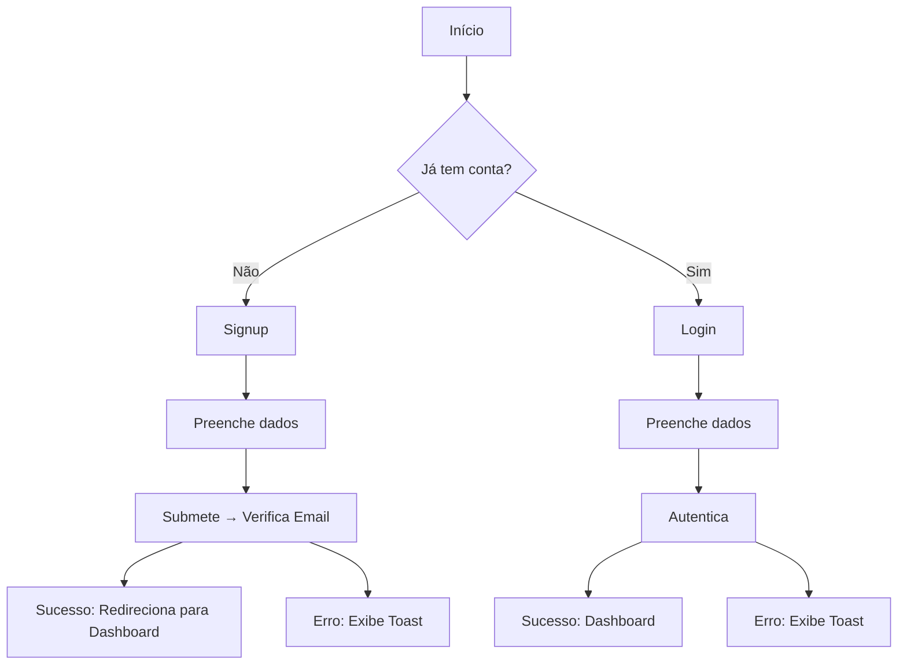

### Documentação Abrangente de Fluxos & Funcionalidades do MealTime

---

**1. Visão Geral da Aplicação**  
- **Nome do App**: MealTime  
- **Versão**: [Preencher com a versão atual]  
- **Propósito Central**: Gerenciar a alimentação, peso, agendamentos e perfis de gatos em lares compartilhados, promovendo saúde e organização para tutores.  
- **Público-Alvo**: Tutores de gatos, famílias, grupos de amigos, administradores de lares compartilhados.

---

**2. Papéis de Usuário & Permissões**  
| Papel            | Permissões                                         | Restrições                        |
|------------------|---------------------------------------------------|-----------------------------------|
| Visitante        | Visualizar tela de login/cadastro, Política/Termos| Sem acesso a recursos do usuário  |
| Usuário Comum    | CRUD em seus dados, gerenciar gatos, lares, logs  | Não pode alterar dados de outros  |
| Administrador    | Gerenciar membros do lar, configurações, convites | Não pode acessar outros lares     |

---

**3. Matriz de Funcionalidades Principais**  
| ID    | Nome do Recurso         | Descrição                                         | Telas/Fluxos Envolvidos           |
|-------|------------------------|---------------------------------------------------|-----------------------------------|
| F-001 | Cadastro de Usuário    | Cadastro via email/senha ou Google OAuth           | Signup, Login, Verificação        |
| F-002 | Gerenciamento de Perfil| Editar dados pessoais, avatar, timezone            | Profile, EditProfile              |
| F-003 | Gatos                  | CRUD de gatos, perfil, histórico, restrições       | Cats, CatDetails, CatEdit, CatNew |
| F-004 | Alimentações           | Registrar, editar, excluir, histórico, detalhes    | Feedings, FeedingDetails, NewFeeding |
| F-005 | Agendamentos           | Criar, editar, excluir horários de alimentação     | Schedules, NewSchedule            |
| F-006 | Lares                  | Criar, editar, excluir, entrar via convite         | Households, Join, HouseholdEdit   |
| F-007 | Notificações           | Listar, marcar como lida, remover                  | Notifications                     |
| F-008 | Estatísticas           | Visualizar gráficos de alimentação e peso          | Statistics                        |
| F-009 | Peso                   | Registrar, visualizar histórico, metas             | Weight                            |
| F-010 | Configurações          | Preferências, tema, idioma, notificações           | Settings                          |
| F-011 | Offline                | Tela de modo offline                              | Offline                           |
| F-012 | Políticas/Termos       | Visualizar política de privacidade e termos        | Privacy, Terms                    |

---

**4. Diagramas de Fluxo de Usuário**
**Fluxo: Criação de Conta**


**Fluxo: Registro de Alimentação**
```mermaid
graph TD
  A[Feedings] --> B[Botão "Registrar"]
  B --> C[Abre Sheet de Nova Alimentação]
  C --> D[Preenche dados]
  D --> E[Submete]
  E --> F[Sucesso: Atualiza histórico]
  E --> G[Erro: Exibe Toast]
```

---

**5. Especificações de Telas**
**Tela**: `Dashboard/Home`
- **Propósito**: Hub principal, visão geral dos gatos, alimentações e atalhos.
- **Componentes**:
  - Header (nome do lar, usuário)
  - Cards de gatos
  - Resumo de alimentações do dia
  - Gráficos rápidos
  - Botões de ação rápida (registrar alimentação, adicionar gato)
- **Ações**:
  - Clicar em gato → Detalhes do gato
  - Clicar em registrar → Sheet de alimentação

**Tela**: `Feedings`
- **Propósito**: Histórico de alimentações, busca, filtro e ações.
- **Componentes**:
  - Lista agrupada por data
  - Busca, ordenação
  - Botão de registrar
- **Ações**:
  - Clicar em item → Detalhe
  - Editar/Excluir registro

**Tela**: `Cats`
- **Propósito**: Gerenciar perfis dos gatos do lar.
- **Componentes**:
  - Cards de gatos
  - Botão adicionar
- **Ações**:
  - Clicar em card → Detalhe
  - Editar/Excluir gato

**Tela**: `Households`
- **Propósito**: Gerenciar lares, membros, convites.
- **Componentes**:
  - Lista de lares
  - Botão criar/entrar
- **Ações**:
  - Editar lar
  - Gerenciar membros

**Tela**: `Profile`
- **Propósito**: Visualizar e editar dados do usuário.
- **Componentes**:
  - Avatar, nome, email
  - Abas: Info, Lares, Gatos
- **Ações**:
  - Editar perfil

---

**6. Regras de Negócio & Lógica**
- **Regra BR-001**:  
  *"Usuários sem lar não podem registrar gatos ou alimentações"*  
  - **Lógica**: `IF !user.householdId THEN redirect('/households')`
- **Regra BR-002**:  
  *"Somente administradores podem excluir lares ou remover membros"*  
  - **Lógica**: `IF user.role !== 'admin' THEN hide/delete options`
- **Regra BR-003**:  
  *"Alimentações só podem ser registradas para gatos do próprio lar"*  
  - **Lógica**: `IF cat.householdId !== user.householdId THEN deny`

---

**7. Modelos de Dados**
**Usuário**:
```json
{
  "id": "UUID",
  "email": "string",
  "full_name": "string",
  "avatar_url": "string|null",
  "created_at": "DateTime",
  "householdId": "UUID|null",
  "preferences": { "language": "string", "timezone": "string" }
}
```
**Gato**:
```json
{
  "id": "UUID",
  "name": "string",
  "photo_url": "string|null",
  "birthdate": "Date|null",
  "weight": "number|null",
  "householdId": "UUID",
  "feeding_interval": "number|null",
  "restrictions": "string|null"
}
```
**Alimentação**:
```json
{
  "id": "UUID",
  "catId": "UUID",
  "userId": "UUID",
  "timestamp": "DateTime",
  "portionSize": "number|null",
  "notes": "string|null"
}
```
**Lar**:
```json
{
  "id": "UUID",
  "name": "string",
  "owner": { "id": "UUID", "name": "string" },
  "members": [ { "userId": "UUID", "role": "string" } ]
}
```

---

**8. Pontos de Integração**
| Serviço         | Propósito                        | Autenticação      | Fluxo de Dados                  |
|-----------------|----------------------------------|-------------------|---------------------------------|
| Supabase Auth   | Autenticação de usuários         | JWT               | Login/Cadastro ↔ Sessão         |
| Supabase DB     | Persistência de dados            | JWT               | CRUD ↔ Dados do app             |
| Notificações    | Push/email de lembretes          | JWT               | Eventos ↔ Notificações          |

---

**9. Tratamento de Erros**
- **Erros Comuns**:
  - `ERR-AUTH-001`: Não autenticado → Redireciona para login
  - `ERR-NET-001`: Sem internet → Exibe tela offline
  - `ERR-FORM-001`: Dados inválidos → Toast de erro
- **Estratégia de fallback**:
  - Erros críticos → Redireciona para tela de erro ou mostra EmptyState
  - Não críticos → Toasts e mensagens inline

---

**10. Apêndice**
- **Abreviações**: CRUD (Criar/Ler/Atualizar/Deletar), JWT (JSON Web Token)  
- **Changelog**:  
  - `[Preencher com histórico de versões]`
- **Links**:  
  - [Figma Designs](#)  
  - [Documentação da API](#)

---

**Notas de Uso**:  
1. Substitua campos entre colchetes `[ ]` por detalhes específicos do app.  
2. Diagramas Mermaid.js podem ser visualizados no GitHub/GitLab.  
3. Mantenha o histórico de versões atualizado no Apêndice.

> **Dica Pro**: Combine este documento com walkthroughs em vídeo para fluxos complexos! 